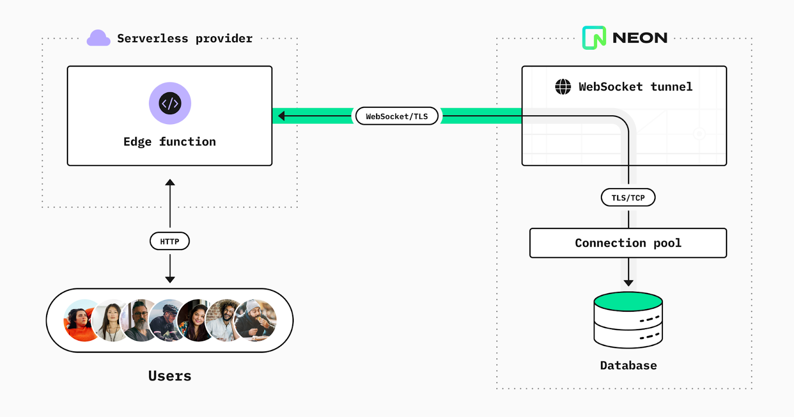
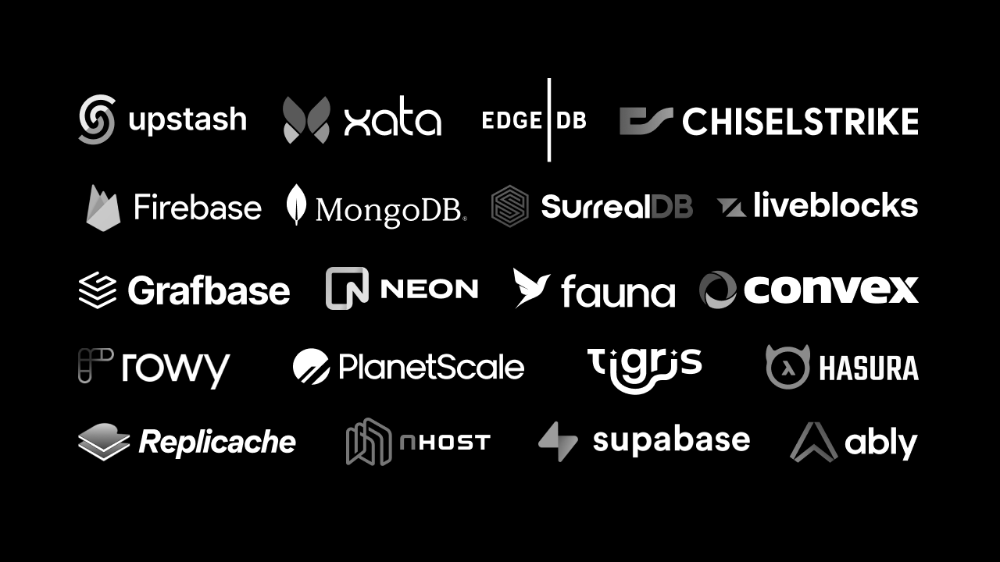

/_ eslint-disable no-var _/
import fg from 'fast-glob'

const x = //fg.sync('_.+(jpg|gif|png|jpeg)', { extglob: true })
fg.sync('_', { onlyFiles: true });
console.log(x)

backend
backend/neon.png
backend/og.png
career
career/banners.png
career/lamp.png
career/react-dark.png
career/react-light.png
career/shirts.png
career/swing.png
content-marketing-personal-brand
content-marketing-personal-brand/final-views.png
content-marketing-personal-brand/google.gif
content-marketing-personal-brand/originally-posted.png
content-marketing-personal-brand/reddit.png
glob.mjs
heroku
heroku/2008.png
heroku/2011.png
heroku/ide.png
heroku/platform.png
heroku/trends.png
home
home/avatar.jpg
home/band.jpg
home/heroine.jpeg
home/jkt.png
home/killa.jpg
home/killa2.jpg
home/live.webp
home/mnq.png
home/pw.png
home/sunny.webp
home/vmp.jpg
how-to-print-in-react-using-iframes
how-to-print-in-react-using-iframes/print.gif
image-gallery-supabase-tailwind-nextjs
image-gallery-supabase-tailwind-nextjs/banner.png
image-gallery-supabase-tailwind-nextjs/supabase.png
image-gallery-supabase-tailwind-nextjs/swag.png
javascript
javascript/edge-runtime.png
loading-placeholder-with-sass
loading-placeholder-with-sass/example.gif
loading-placeholder-with-sass/facebook.png
loading-placeholder-with-sass/final-result.gif
loading-placeholder-with-sass/linkedin.png
mysql-planetscale
mysql-planetscale/checkly-firebase.png
mysql-planetscale/checkly.png
mysql-planetscale/firebase.png
mysql-planetscale/redis.png
nextjs-conf-2022-recap
nextjs-conf-2022-recap/qna.jpg
react-frameworks
react-frameworks/evolving.jpg
react-frameworks/iceberg.png
react-state-management
react-state-management/amazon.png
react-state-management/context.png
react-state-management/figma.png
react-state-management/immer.png
react-state-management/nomad.png
react-state-management/redux.png
react-state-management/state-machines.gif
real-time-post-views
real-time-post-views/blog-post-views.png
real-time-post-views/db-usage.png
real-time-post-views/firebase
real-time-post-views/firebase/step1.png
real-time-post-views/firebase/step2.png
real-time-post-views/firebase/step3.png
real-time-post-views/firebase/step4.png
real-time-post-views/firebase/step5.png
real-time-post-views/testing-database.png
space-invaders-with-python
space-invaders-with-python/space-invaders.png
stripe
stripe/animation-example.gif
stripe/banner.png
stripe/buttons.gif
stripe/camphor.png
stripe/color-palette.png
stripe/css-example.gif
stripe/salesforce.svg
stripe/spinning-animation.gif
stripe/typography.png
stripe/website.png
style-guides-component-libraries-design-systems
style-guides-component-libraries-design-systems/atomize.png
style-guides-component-libraries-design-systems/banner.jpg
style-guides-component-libraries-design-systems/button.png
style-guides-component-libraries-design-systems/buttons.png
style-guides-component-libraries-design-systems/component-driven-development.jpg
style-guides-component-libraries-design-systems/component-library.png
style-guides-component-libraries-design-systems/components.png
style-guides-component-libraries-design-systems/design-system.png
style-guides-component-libraries-design-systems/design-tokens.png
style-guides-component-libraries-design-systems/icons.png
style-guides-component-libraries-design-systems/monorepo.png
style-guides-component-libraries-design-systems/storybook-docs.png
style-guides-component-libraries-design-systems/storybook-flow.png
style-guides-component-libraries-design-systems/style-guide.png
style-guides-component-libraries-design-systems/website.png
tailwind
tailwind/analytics.jpg
technical-recruiting-is-broken
technical-recruiting-is-broken/alexa.jpg
technical-recruiting-is-broken/amazon.jpg
technical-recruiting-is-broken/derek.jpg
technical-recruiting-is-broken/katie.jpg
technical-recruiting-is-broken/linkedin-bio.jpg
technical-recruiting-is-broken/recruiter.jpg
technical-recruiting-is-broken/recruiter2.jpg
technical-recruiting-is-broken/recruiter3.jpg
video
video/aperture.png
video/banner.png
video/diffused.png
video/exposure.png
video/focal-lengths.gif
video/lighting.png
video/motion-blur.png
video/peaks.png
video/pop-filter.png
video/resolution.png
video/shutter-speed.png
video/studio.png
              

      

[text](.)
[text](content-marketing-personal-brand)

[text](.) [text](backend)   [text](career)       [text](content-marketing-personal-brand)    

[text](..) [text](.) [text](backend)   [text](career)       [text](content-marketing-personal-brand)     [text](heroku)      [text](home)            [text](how-to-print-in-react-using-iframes)  [text](image-gallery-supabase-tailwind-nextjs)    [text](javascript)  [text](loading-placeholder-with-sass)    

/images/real-time-post-views
/images/real-time-post-views/firebase
/images/real-time-post-views/firebase/step1.png
/images/real-time-post-views/firebase/step2.png
/images/real-time-post-views/firebase/step3.png
/images/real-time-post-views/firebase/step4.png
/images/real-time-post-views/firebase/step5.png
/images/real-time-post-views/blog-post-views.png
/images/real-time-post-views/db-usage.png
/images/real-time-post-views/testing-database.png

[text](real-time-post-views) [text](real-time-post-views/firebase)
